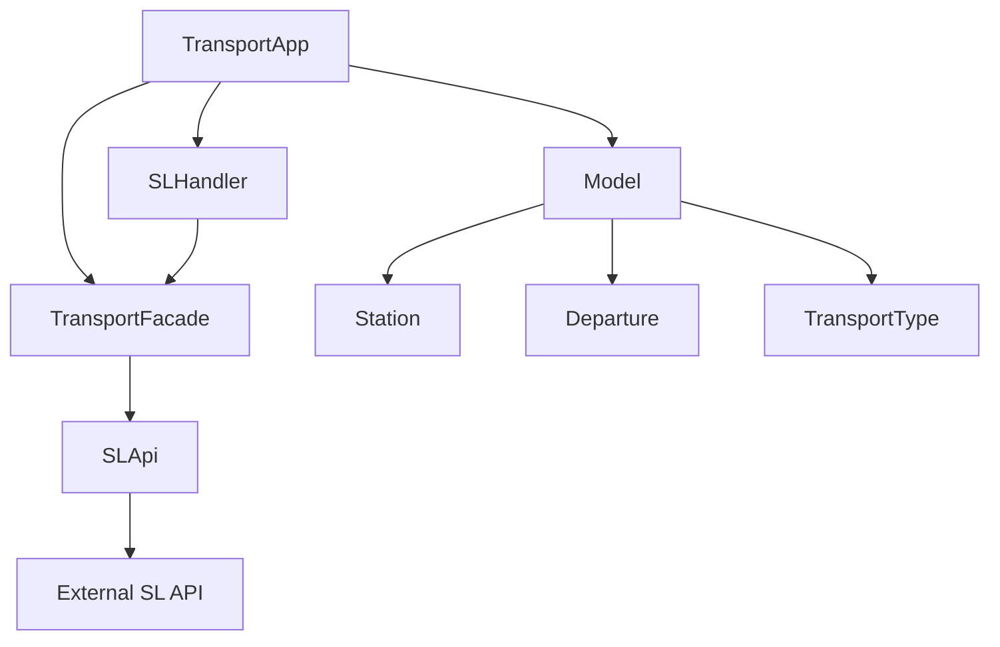
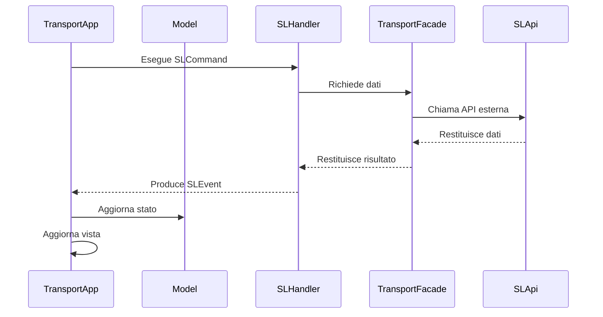
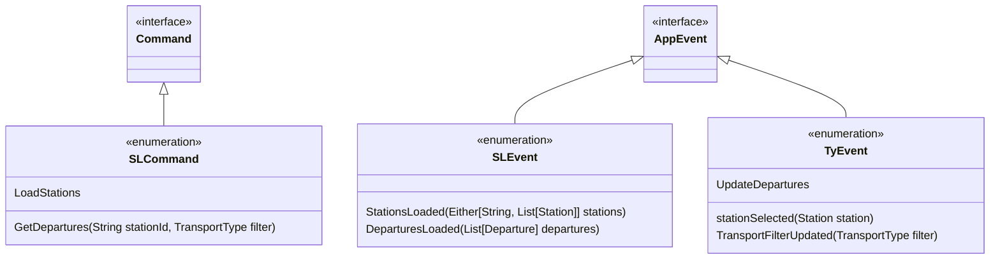

# Design Architetturale

## Architettura Complessiva
L'applicazione Stockholm Transit Tracker segue un'architettura a layer. Questa struttura permette una chiara separazione delle responsabilità, facilitando la manutenibilità, la testabilità e l'estensibilità del sistema.
### Layer dell'Applicazione

- _Presentation Layer_: Gestisce l'interfaccia utente e le interazioni. 
    - Componenti principali: TransportApp, view function
    - Tecnologie: Tyrian, Scala.js

- _Application Layer_: Gestisce la logica di business e i casi d'uso.
  - Componenti principali: SLHandler, Model
  - Responsabilità: Processare i comandi, gestire gli eventi, aggiornare lo stato dell'applicazione

- _Domain Layer_: Contiene la logica di business core e le entità del dominio.
  - Componenti principali: Station, Departure, TransportType
  - Responsabilità: Definire le strutture dati e le regole di business fondamentali

- _Infrastructure Layer_: Si occupa dei servizi esterni e delle fonti di dati.
    - Componenti principali: SLApi, TransportFacade
    - Responsabilità: Comunicazione con API esterne, gestione dei dati persistenti

## Diagramma Architetturale di Alto Livello

Questo diagramma mostra le principali componenti dell'applicazione e le loro relazioni.

## Pattern Architetturali Utilizzati

- **_Model-View-Update (MVU)_**
Implementato attraverso Tyrian, questo pattern separa la logica di stato (Model), la presentazione (View) e l'aggiornamento dello stato (Update).

- **_Command-Query Responsibility Segregation (CQRS)_**
Separazione tra comandi (SLCommand) che modificano lo stato e query che leggono lo stato, implementato attraverso la struttura degli eventi e dei comandi.

- **_Event Sourcing_**
Utilizzo di eventi (SLEvent e TyEvent) per rappresentare cambiamenti nello stato dell'applicazione.

- **_Repository Pattern_**
Implementato attraverso SLApi, che astrae l'accesso ai dati esterni.

- **_Facade Pattern_**
TransportFacade agisce come una facciata, semplificando l'interfaccia per l'accesso ai servizi di trasporto.

## Componenti Principali del Sistema

- **TransportApp**: Componente principale che gestisce il ciclo di vita dell'applicazione.
- **Model**: Rappresenta lo stato dell'applicazione.
- **SLHandler**: Gestisce i comandi SL e produce eventi corrispondenti.
- **TransportFacade**: Astrae l'accesso ai servizi di trasporto.
- **SLApi**: Interfaccia per l'accesso ai dati esterni del servizio SL.

## Interazioni tra Componenti

## Gestione degli Eventi e dei Comandi

