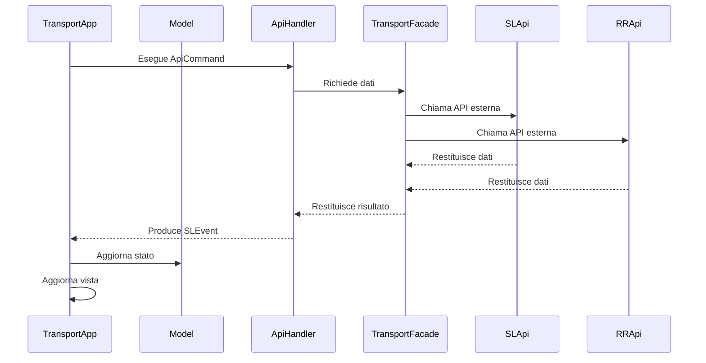
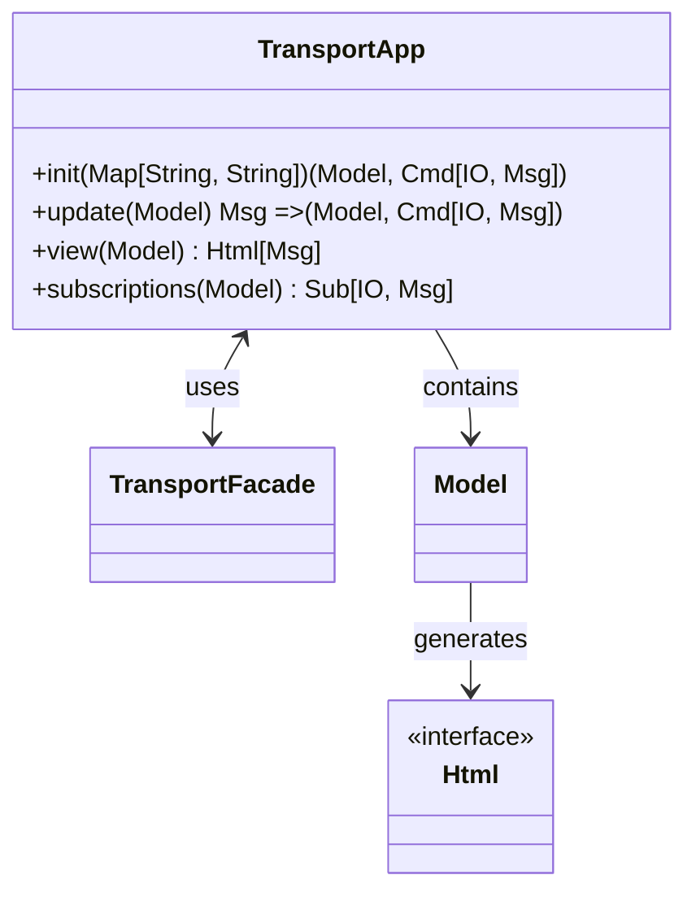
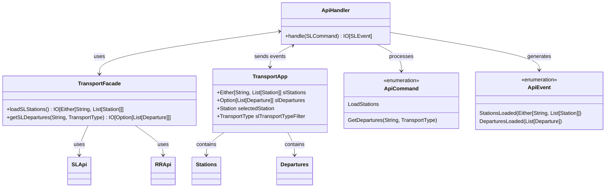
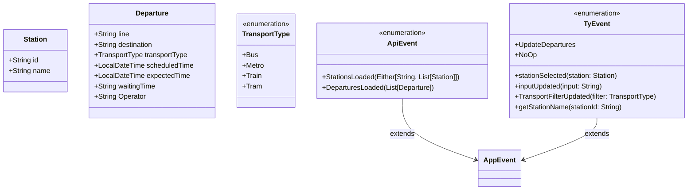
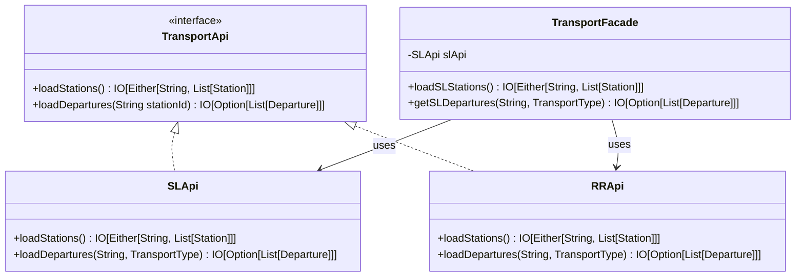
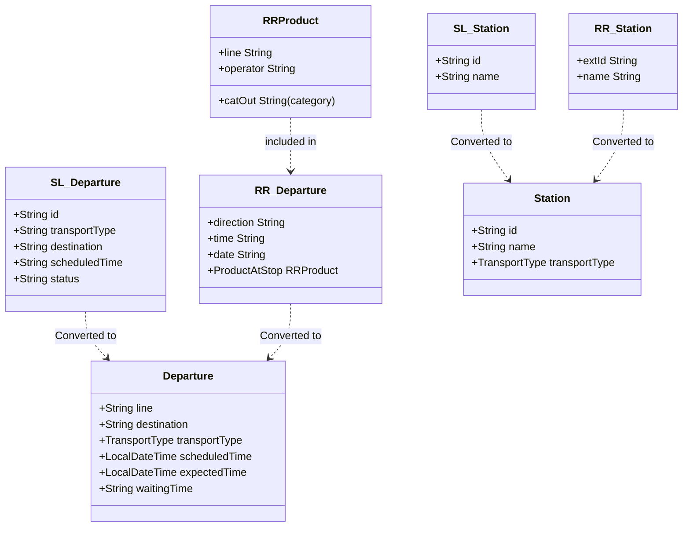

# Design Dettagliato

Il design dettagliato dell'applicazione Stockholm Transit Tracker si basa su quattro layer principali, seguendo i principi della Clean Architecture. Ogni layer ha responsabilità specifiche e interagisce con gli altri in modo definito.

### Componenti Principali del Sistema

- **TransportApp**: Componente principale che gestisce il ciclo di vita dell'applicazione.
- **Model**: Rappresenta lo stato dell'applicazione.
- **ApiHandler**: Gestisce i comandi SL e produce eventi corrispondenti.
- **TransportFacade**: Astrae l'accesso ai servizi di trasporto.
- **SLApi**: Interfaccia per l'accesso ai dati esterni del servizio SL.
- **RRApi**: Interfaccia per l'accesso ai dati esterni del servizio ResRobot.

### Interazioni tra Componenti

## Presentation Layer

Il Presentation Layer è responsabile dell'interfaccia utente e delle interazioni con l'utente.

### Componenti Principali
- `TransportApp`: Classe principale che orchestral'intera applicazione.
- `view` function: Genera la rappresentazione HTML dell'interfaccia utente.

### Responsabilità
- Renderizzare l'interfaccia utente
- Catturare le interazioni dell'utente
- Inviare comandi al layer sottostante
- Aggiornare la vista in base ai cambiamenti di stato

### Diagramma

## 2. Application Layer

L'Application Layer gestisce la logica di business e coordina le interazioni tra il Presentation Layer e il Domain Layer.

### Componenti Principali
- `ApiHandler`: Processa i comandi e genera eventi relativi alle Api, reindirizzandoli alla Facade opportuna.
- `Model`: Rappresenta lo stato dell'applicazione.

### Responsabilità
- Processare i comandi ricevuti dal Presentation Layer
- Aggiornare lo stato dell'applicazione
- Generare eventi in risposta ai comandi
- Coordinare le interazioni con il Domain Layer e l'Infrastructure Layer

### Diagramma

## 3. Domain Layer

Il Domain Layer contiene la logica di business core e le entità del dominio.

### Componenti Principali
- `models`: modello di dominio
  - `Station`: Rappresenta una stazione di trasporto.
  - `Departure`: Rappresenta una partenza.
  - `TransportType`: Enumerazione per distinguere tra diversi tipi di trasporto.
- `Events`: Eventi relativi al dominio.
  - Specifici per ogni diversa responsabilità del dominio (ApiEvent, TyrianEvent).

### Responsabilità
- Definire le strutture dati fondamentali del dominio
- Implementare la logica di business core
- Fornire un'interfaccia per le operazioni di dominio

## 4. Infrastructure Layer

L'Infrastructure Layer si occupa delle interazioni con servizi esterni e della gestione dei dati persistenti.

### Componenti Principali
- `SLApi`: Interfaccia per la comunicazione con l'API Stockholm Local.
- `RRApi`: Interfaccia per la comunicazione con l'API ResRobot.
- `TransportFacade`: Astrae l'accesso ai servizi di trasporto.

### Responsabilità
- Comunicare con API esterne
- Gestire la persistenza dei dati
- Convertire i dati esterni nel formato del dominio
- Fornire un'interfaccia pulita per l'accesso ai dati esterni

### Diagramma

Utilizzo di DTO per l'Astrazione delle Sorgenti Dati
Un aspetto chiave dell'Infrastructure Layer è l'utilizzo di Data Transfer Objects (DTO) nell' applicazione **SLStation** e **SLDeparture**. Questi DTO agiscono come intermediari tra le API esterne e il modello di dominio dell'applicazione.

L'utilizzo di questi DTO offre diversi vantaggi:

- **_Disaccoppiamento_**: I DTO isolano il modello di dominio dalle strutture dati specifiche delle API esterne.
- **_Flessibilità_**: Permettono di integrare facilmente nuove fonti di dati senza modificare il modello di dominio.
- **_Unificazione_**: Consentono di unificare dati provenienti da diverse sorgenti (es. SL, altre compagnie di trasporto) in un unico modello coerente.
- **_Evoluzione Indipendente_**: Il modello di dominio può evolvere indipendentemente dai cambiamenti nelle API esterne.

