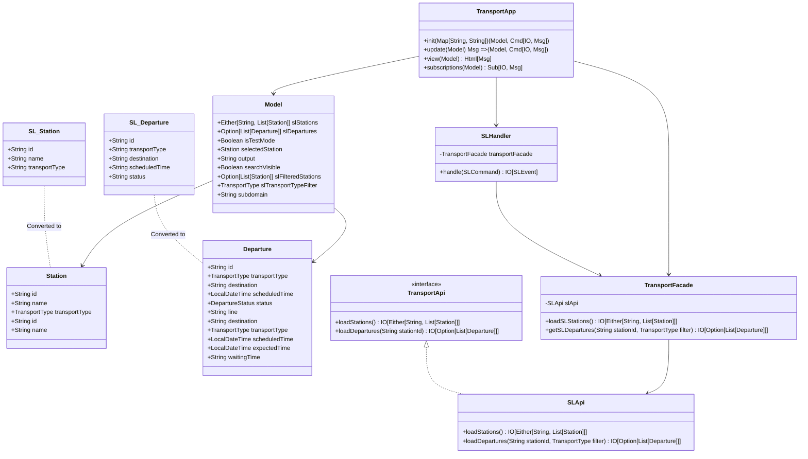
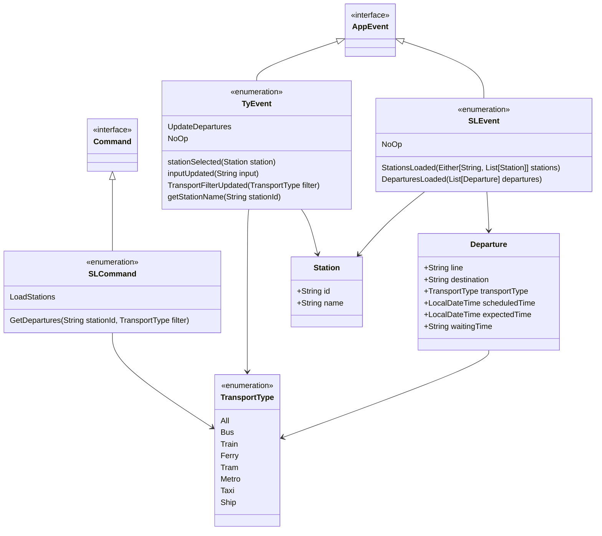
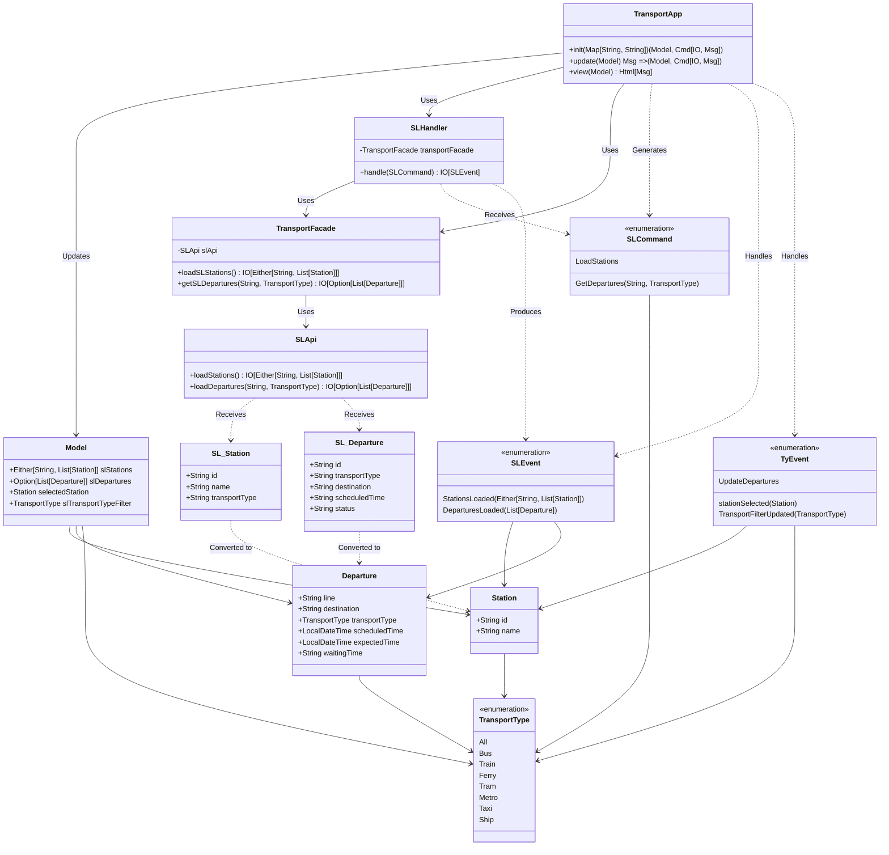

# Stockholm Transit Tracker
## Overview
This Transport App is a Scala-based application designed to provide real-time information about public transportation in Stockholm. It interfaces with the Stockholm Local (SL) API to fetch and display station information and departure times for various types of public transport.
The architecture allows for reusability and modularity, in order to have freedom of choiche about data sources and the application itself, making it a proof-of-concept for a generic Tyrian Application.

## Architecture

The application follows a clean architecture pattern, separating concerns into distinct layers:

1. _**Presentation Layer**_: Handles user interface and interactions
2. _**Application Layer**_: Manages business logic and use cases
3. _**Domain Layer**_: Contains core business logic and entities
4. _**Infrastructure Layer**_: Deals with external services and data sources

### Application Overview




This diagram illustrates the high-level structure of the application, showing the relationships between key classes and interfaces.

### Events and Commands



This diagram shows the flow of events and commands within the application, demonstrating how user actions are translated into application state changes.

### Core Components and Interactions



This diagram provides a detailed view of how core components interact, including data transformations and the flow of information through the system.

## Key Components

- `TransportApp`: The main application class that orchestrates the entire system.
- `Model`: Represents the application's state.
- `TransportFacade`: Acts as an intermediary between the application and the SL API.
- `SLApi`: Handles direct communication with the Stockholm Local API.
- `SLHandler`: Processes commands and generates events related to SL data.
- `Station` and `Departure`: Domain entities representing transport stations and departures.

### Getting Started
To run this project locally, follow these steps:
- Ensure you have sbt (Scala Build Tool) and yarn installed on your system.
- Clone this repository to your local machine.
- Navigate to the project directory in your terminal.
- Run the following commands:

```bash
sbt clean fastLinkJS
yarn install
yarn start
```
Open your web browser and navigate to the address provided by the yarn start command (typically http://localhost:1234).